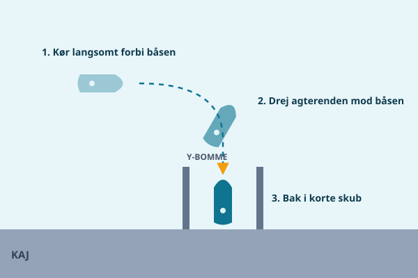

I mange lystbådehavne langs Limfjorden ligger gæstepladserne som båse mellem Y-bomme eller pæle, og her er det normalt at bakke ind frem for at sejle forlæns ind. Det virker uoverskueligt de første gange, men med den rigtige teknik er det en manøvre, du hurtigt får rutine i.

## Hvorfor bakke ind

Der er to gode grunde til, at de fleste vælger at bakke ind i en bås frem for at gå forlæns ind:

- **Nemmere at komme fra borde**, fordi du typisk skal fortøje forenden til en pæl eller bom, og den er nemmest at nå, når den vender ud mod midtergangen.
- **Nemmere afgang senere**, fordi du blot skal kaste los og sejle ligeud, i stedet for at skulle bakke ud af en trang bås, når du forlader pladsen.

## Brug propelvirkningen: ikke bekæmp den

Fra grundlæggende manøvrering husker du, at propellen får agterenden til at trække til én bestemt side, når du bakker, det kaldes propelvirkning eller "kick". De fleste både med højregående propel trækker agterenden mod bagbord i bak. Denne "fejl" er faktisk et værktøj: hvis du planlægger indsejlingen, så agterenden alligevel skal dreje den vej, propellen trækker, får du en manøvre, der næsten styrer sig selv. Kender du din egen båds propelvirkning, kan du bruge den til at spare dig for unødige rorudslag.

## Trin for trin

1. **Kør forbi båsen** i langsom fart, så du får et roligt overblik over bredden, naboernes både og eventuelle forhindringer som fortøjningsliner i vandet.
2. **Drej agterenden mod båsen**, mens du stadig har fremadgående fart, gerne i den retning, propelvirkningen alligevel vil trække dig, når du begynder at bakke.
3. **Bak i korte, kontrollerede skub**: giv et kort skub bak, slip gassen igen, og lad båden glide et stykke i den ro, der følger. I pauserne mellem skub styrer båden faktisk bedre, fordi der ikke er konstant propelstrøm, der forstyrrer roret.
4. Gentag de korte skub, mens du finjusterer retningen, indtil agterenden er inde mellem Y-bommene eller pælene.

## Styr med gas, ikke med rat

En hyppig nybegynderfejl er at forsøge at styre en bakke-manøvre alene med rorudslag, som om båden var en bil. I bak reagerer de fleste både langsommere og mindre forudsigeligt på roret end på fremad. Brug i stedet gaskontrol som dit primære styremiddel: et kort skub på den ene side af neutral flytter agterenden mere effektivt end et stort rorudslag alene. Se rorudslaget som finjustering, gassen er hovedværktøjet.

## Klargøring inden du bakker ind

Præcis som ved et almindeligt anløb skal alt være klart, før du sætter manøvren i gang:

1. **Fendere ud** i begge sider, da du typisk har naboer tæt på i begge sider af båsen.
2. **Agtertrosse og fortrosse klar**, og en person klar til at tage fat i pæl eller bom, så snart båden er tæt nok på.
3. Kend afstanden til pælene bagved dig, så du ikke bakker for langt og rammer bagkajen eller broen.

## Når det går skævt

Selv erfarne sejlere rammer skævt en gang imellem, bommen kommer forkert, agterenden driver den forkerte vej, eller vinden skubber båden ud af kurs midt i manøvren. Reglen er enkel:

1. **Stop**, giv ikke mere gas i håb om, at det retter sig selv.
2. **Kør ud** af båsen igen med rolig fremadgående fart.
3. **Prøv igen** fra begyndelsen med et roligere tempo.

Der er ingen skam i at bruge tre forsøg på at ramme en bås korrekt, tværtimod er det tegn på god dømmekraft at afbryde en manøvre, der er ved at gå galt, i stedet for at tvinge den igennem. De sejlere i havnen, der ser mest rutinerede ud, er ofte dem, der roligt kører ud og prøver igen, når det ikke lykkes første gang.

## Øv i god tid

Vælg gerne en dag med svag vind og få tilskuere, første gang du øver dig i en bås, mange gæstehavne i Limfjorden har ledige båse uden for højsæsonen, hvor du kan øve uden pres. Bak ind og kør ud igen flere gange i træk, og læg mærke til, hvordan din båd faktisk reagerer på propelvirkning og korte gasskub. Den fornemmelse er individuel fra båd til båd, og den eneste måde at lære den på er at prøve den af, indtil den sidder i fingrene.

> **Husk:** Bak i korte skub med pauser imellem, brug gassen til at styre, og stop og prøv igen frem for at tvinge en skæv manøvre igennem.
