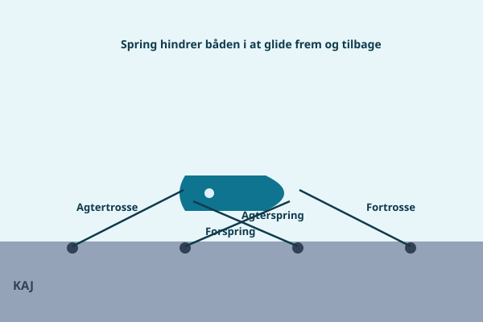

Et vellykket anløb er kun halvdelen af arbejdet, resten afhænger af, hvor godt du fortøjer, når båden først ligger ved kajen. En god fortøjning betyder, at du kan gå fra borde og sove roligt om natten, uanset om vejret skifter, mens en sjusket fortøjning kan koste dig en skrabet skude eller værre.

## De fire trosser og hvad de gør

En fuldt fortøjet båd bruger typisk fire trosser, som hver har sin egen opgave:

- **Fortrosse**, går fra forenden og holder båden ind mod kajen for.
- **Agtertrosse**, går fra agterenden og holder båden ind mod kajen agter.
- **Forspring**, går fra forenden skråt agterud til en pullert eller ring, og hindrer båden i at glide fremad langs kajen.
- **Agterspring**, går fra agterenden skråt fremad til en pullert, og hindrer båden i at glide agterud langs kajen.

Fortrosse og agtertrosse holder altså båden *ind mod* kajen, mens de to spring hindrer den i at bevæge sig *langs* kajen, noget den ellers nemt gør, hvis andre både passerer med kølvand, eller hvis der er strøm i havnebassinet.

## Fendere i rigtig højde

Hæng fenderne, så de rammer kajkanten i den højde, kajen faktisk har, ikke i den højde, du plejer. Juster dem, mens du ligger til, og tjek dem igen, hvis vandstanden ændrer sig markant i løbet af dit ophold. En fender, der hænger for højt, beskytter ikke skroget; en fender, der hænger for lavt, gør ingen gavn og kan endda fanges under kajkanten.

## De tre knob du skal kunne

Du behøver ikke kunne dusinvis af knob for at fortøje sikkert, tre knob dækker stort set alle situationer.

### 1. Pælestik (bowline)

Pælestik laver en fast løkke, der ikke strammer sig selv til, og som er let at løse op igen selv efter belastning. Det er knuden, du bruger, når du skal have et fast øje i enden af en trosse, for eksempel til at kaste over en pæl.

1. Læg en lille løkke på trossen et stykke fra enden, den skal ligne et "hul", som den løse ende kan gå op igennem.
2. Før den løse ende op gennem løkken.
3. Før enden bagom den lange del af trossen.
4. Før enden ned gennem løkken igen, samme vej den kom op.
5. Stram til ved at trække i den lange del, mens du holder fast i løkken, så den beholder sin form.

### 2. Klampestik (cleat hitch)

Klampestik bruger du til at fæstne en trosse på en klampe om bord eller på kajen, hurtigt at lave og hurtigt at løse, selv når trossen har været under belastning.

1. Før trossen rundt om klampens fod, i den fjerneste ende fra hvor trossen kommer fra.
2. Læg et kryds hen over toppen af klampen i et ottetal-mønster, én gang rundt om den ene arm, én gang rundt om den anden.
3. Afslut med et halvt stik, hvor du drejer den sidste løkke, så den låser sig selv fast under den forrige omgang.
4. Undgå for mange omgange, to til tre kryds plus det låsende stik er nok; for mange omgange gør knuden svær at løse igen.

### 3. Rundtørn med to halvstik

Denne knude bruger du, når du skal fæstne en trosse om en pæl, ring eller anden fast genstand, og du gerne vil kunne justere længden, mens den holder godt fast.

1. Før trossen en hel omgang rundt om pælen eller ringen, det er selve "rundtørnen", som tager det meste af belastningen og aflaster resten af knuden.
2. Læg et halvstik: før den løse ende rundt om den lange del af trossen og gennem den løkke, det danner.
3. Læg endnu et halvstik samme vej lige under det første.
4. Stram alt til, så de to halvstik ligger tæt sammen mod rundtørnen.

## Elastik i fortøjningen

En stram, ueftergivelig trosse giver hårde ryk, hver gang en bølge eller et kølvand løfter båden. Sørg for lidt elastik i systemet, enten ved at bruge en fortøjningstrosse med naturligt strækfibre, eller ved at montere en gummifjeder (en "rykdæmper") på trossen. Det reducerer belastningen på både trosse, klampe og pullert markant og giver en mere stille nat om bord.

## Tjek før du forlader båden

Gå altid en runde og tjek alle fire trosser, før du forlader båden, også selvom du "kun lige skal handle ind". Tænk især på vandstandsændringer: stiger vandet, kan for stramme trosser komme til at hænge båden op i kajen; falder vandet, kan slappe trosser blive for korte og løfte fenderne af plads. Lidt slæk med god margin er sjældent forkert.

## Tommelfingerregler for trossetykkelse

| Bådlængde | Anbefalet trossetykkelse |
|---|---|
| Op til 6 m | 10 mm |
| 6-9 m | 12 mm |
| 9-12 m | 14-16 mm |
| Over 12 m | 16 mm eller derover |

Tallene er tommelfingerregler, tjek altid din båds egen manual eller spørg din forhandler, hvis du er i tvivl, især hvis du sejler meget i blæsende forhold.

> **Husk:** Fire trosser holder båden på plads og roligt liggende, lær pælestik, klampestik og rundtørn med to halvstik, så sidder fortøjningen rigtigt hver gang.
