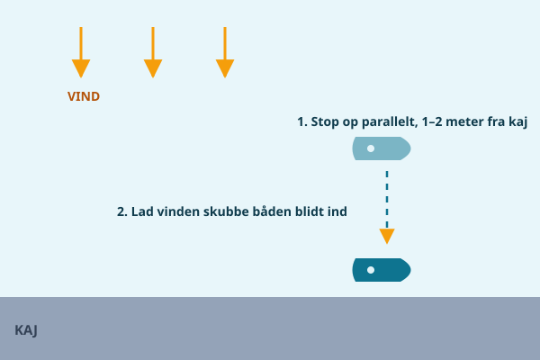

Når vinden begynder at friske, ændrer havnemanøvren karakter. De samme grundprincipper gælder stadig — flad vinkel, styrefart, en klar plan — men nu skal du aktivt bruge vinden i stedet for bare at tage højde for den. Denne guide er for dig, der har styr på den rolige anløb langs kaj, og som nu vil kunne håndtere en dag med mere vind i pladsen.

## Pålandsvind: lad vinden gøre arbejdet

Pålandsvind — vind, der blæser ind mod kajen — lyder farligt, men er faktisk den situation, hvor vinden arbejder for dig, hvis du bruger den rigtigt.

1. Sigt mod en position **parallelt med kajen, cirka 1–2 meter ude**, i stedet for at sigte direkte på kajkanten.
2. Tag farten helt af her, så båden ligger stille eller næsten stille ud for pladsen.
3. Lad vinden **skubbe båden ind mod kajen i sit eget tempo**, mens du holder styring med små gaskorrektioner.
4. Hav fendere og trosser klar, så I kan tage imod og fortøje, i det øjeblik båden er tæt nok på.

Fordelen ved denne teknik er, at du aldrig kører aktivt ind mod kajen med fart på — vinden lukker den sidste meter for dig, roligt og forudsigeligt.

## Fralandsvind: vær hurtig med forenden

Fralandsvind — vind, der blæser væk fra kajen — er den sværeste af de to, fordi vinden konstant arbejder imod dig og vil trække båden væk igen, så snart du slipper gassen.

1. Vælg en **stejlere anløbsvinkel** end normalt, gerne 40–60 grader, for at kompensere for, at vinden vil dreje bådens forende væk fra kajen.
2. Kør med lidt mere fremdrift end du ellers ville, fordi vinden konstant "spiser" af din fart mod kajen.
3. **Fortøj forenden først** — det er den ende, vinden hurtigst trækker væk, hvis den ikke sidder fast.
4. Brug derefter motoren, gerne med et forsigtigt gasstød frem mod fortrossen, til at **svinge agterenden ind mod kajen**, mens du tager agtertrossen på.

Vent aldrig med forendens trosse i fralandsvind — det er den fejl, der oftest ender med, at hele båden driver væk fra kajen igen, mens besætningen står klar med trosser, de ikke kan nå at bruge.

## Sidevind langs kajen

Blæser vinden på tværs af selve kajstrækningen, er reglen enkel: **læg til mod vinden, hvis pladsen tillader det.** En båd, der anløber mod vinden, bremses naturligt og er let at holde præcist på plads. En båd, der anløber med vinden i ryggen, glider hurtigere end forventet og er svær at stoppe præcist, fordi vinden lægger sig oveni fremdriften.

Har du valget mellem to ledige pladser, så vælg altid den, hvor du kan anløbe op mod vinden.

## Kend din grænse

Der er vejrforhold, hvor den kloge beslutning ikke er en bedre teknik, men en anden plads. Hvis vinden er så kraftig, at du ikke længere kan holde kontrolleret styrefart, eller at vindstødene overrumpler din styring, så led efter en plads i læ — bag en mole, inde i et hjørne af havnebassinet, eller ved en nabo-kaj, der ligger bedre beskyttet. At vælge en dårligere, men roligere plads er ikke et nederlag. Det er sund dømmekraft, og det er præcis, hvad erfarne sejlere gør.

## Brug springet aktivt

Springet — trossen der løber skråt fra midtskibs eller agter og frem mod en pullert foran båden — er et af de mest undervurderede værktøjer i frisk vind. Sidder forspringet fast, og du giver et forsigtigt gasstød **fremad**, vil båden dreje agterenden ind mod kajen, fordi trossen holder forenden fast, mens motoren skubber resten af båden rundt. Det er en effektiv måde at trække en modvillig agterende på plads uden at skulle manøvrere hele båden om igen.

## Rolig kommunikation

I frisk vind stiger stressniveauet naturligt hos alle om bord, og det er lige nøjagtig her, kommunikationen skal blive roligere, ikke mere anspændt. Aftal korte, tydelige kommandoer på forhånd — "tag forenden", "vent", "giv slip" — og undgå at råbe i affekt. En gast, der bliver råbt ad midt i en svær manøvre, laver oftere fejl, ikke færre. Et roligt "vi prøver igen" er altid bedre end panik ved kajen.

> **Husk:** I pålandsvind lader du vinden trykke dig ind — i fralandsvind fortøjer du forenden først og svinger agterenden ind med motoren.
