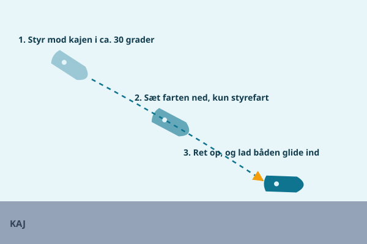

At lægge til langs en almindelig kaj er den manøvre, du kommer til at bruge oftest, og den, alle andre manøvrer i bund og grund er en variation af. Kan du denne roligt og kontrolleret, har du fat i det vigtigste håndværk som motorbådssejler.

## Klargøring, før du går ind

Al klargøring skal være færdig, mens du stadig har god plads og god tid uden for kajen, ikke i sidste øjeblik.

1. **Fendere ud** i den højde, kajkanten faktisk har. Tjek kajen, mens du nærmer dig, så du ikke sætter fenderne for højt eller for lavt.
2. **Trosser klar for og agter**, lagt løst op på dækket så de kan nås og kastes uden at skulle redes ud først.
3. **Briefing af besætningen**: hvem tager fortrossen, hvem tager agtertrossen, og hvem holder styr på farten. Sig det højt, før I går ind, ikke midt i manøvren.
4. Den vigtigste sikkerhedsregel: **ingen arme eller ben mellem båd og kaj**. Fendere og hænder skubber, de tager ikke imod med kroppen.

## Trin 1: anløb i en flad vinkel

Sigt mod pladsen i en vinkel på cirka 20-40 grader i forhold til kajen, ikke rettet lige på den. Brug kun styrefart, altså den laveste fart, hvor du stadig har fuld kontrol over roret. Med en flad vinkel har du hele tiden mulighed for at rette op eller trække dig væk igen, hvis noget ændrer sig, en anden båd, et pludseligt vindstød eller en fortøjning, der sidder anderledes end ventet.

## Trin 2: ret op og tag farten af

Kort før du når kajen, retter du båden op, så den ligger parallelt med kajkanten, og du tager farten helt af. Her er et kort skub bak et af de mest nyttige greb, du kan lære: en kort, bestemt "gas bak" i et par sekunder bremser fremdriften uden at give båden bagudgående fart, fordi du slipper gassen igen, så snart farten er væk.

Målet er, at båden næsten ligger stille, lige idet den rører kajen, ikke at den triller ind med resterende fart, som skal opsluges af fendere og mennesker.

## Trin 3: stop, positionér og fortøj

Stop båden ud for den plads på kajen, hvor du faktisk vil ligge, ikke et par meter for langt fremme eller tilbage. Herfra fortøjer du efter vindforholdene:

- Hvis der er lidt vind eller strøm, så tag **midtskibstrossen eller agtertrossen først**, den holder båden på plads, mens resten af fortøjningen kommer på i ro.
- Hvis vinden presser båden væk fra kajen, skal du være hurtigere med den trosse, der er tættest på den side, vinden skubber fra.

Når den første trosse sidder, har du tid til at få resten af fortøjningen på plads uden stress.

## Hvem gør hvad, når I er to

Er I to om bord, er en klar rollefordeling guld værd:

1. **Skipperen** styrer båden ind, holder øje med vinkel og fart, og har det sidste ord om farten hele vejen ind.
2. **Gasten** står klar med den trosse, der skal på først, typisk midtskibs eller agter, og springer først i land, når båden er tæt nok på og farten er væk, aldrig før.
3. Aftal på forhånd et enkelt signal for "vent" og "spring nu", så I ikke skal råbe komplicerede instrukser midt i manøvren.

## De klassiske fejl

De fleste uheld ved kajen skyldes en håndfuld gentagne fejl:

- **For meget fart** ind mod kajen, "bare lidt ekstra fart for at have styring" er den hyppigste årsag til hårde landinger.
- **For stejl vinkel**, så du rammer kajen næsten vinkelret i stedet for at glide langs den.
- **Panikgas**, hvor skipperen giver fuld gas frem eller bak i sidste øjeblik i stedet for et kort, roligt skub.
- At **springe for tidligt** i land, før båden reelt er tæt nok på og roligt liggende.

## Øv dig, hvor det er billigt

Den bedste måde at blive tryg ved denne manøvre er at øve den, hvor konsekvenserne er små: find en fri, lang kaj i stille vejr, mange lystbådehavne i Limfjorden har ledige strækninger uden for sæsonen, og læg til og kast los igen ti gange i træk. Efter et par forsøg begynder fornemmelsen for fart og vinkel at sidde i kroppen, så du ikke skal tænke over det, næste gang du kommer ind med tilskuere på broen.

> **Husk:** Flad vinkel, styrefart, og tag farten af i god tid, så er resten bare rutine.
