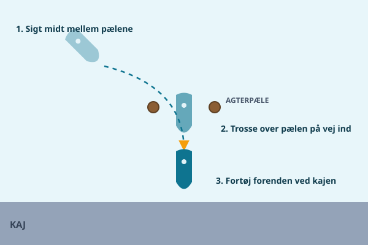
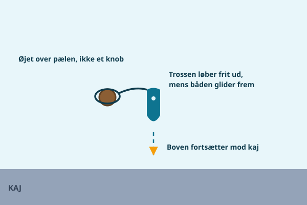
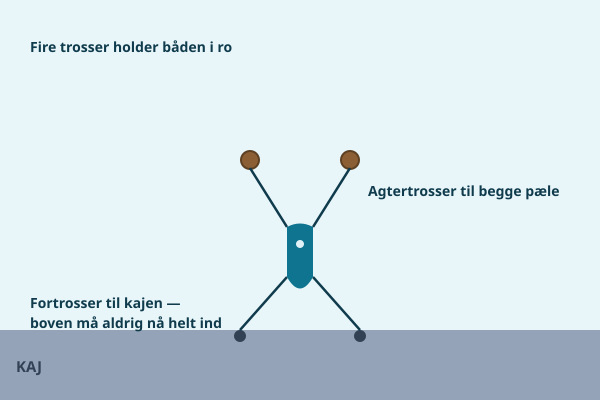
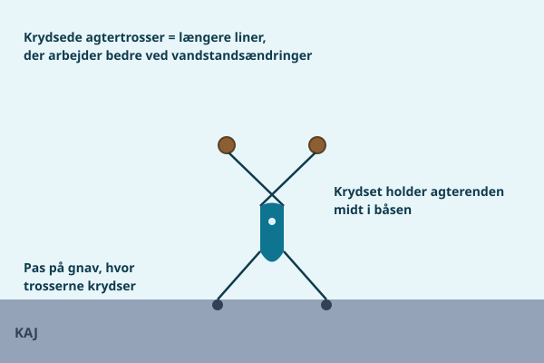
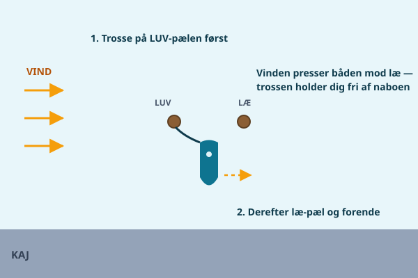
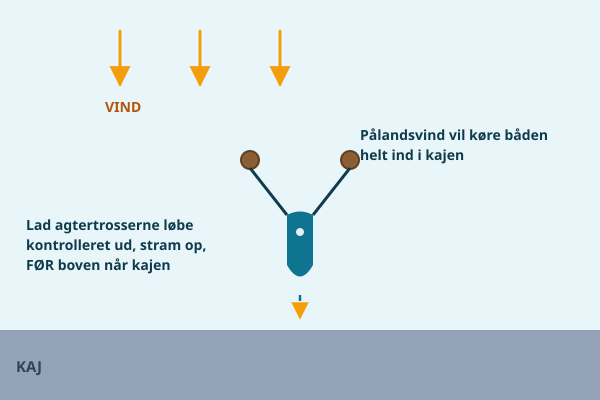
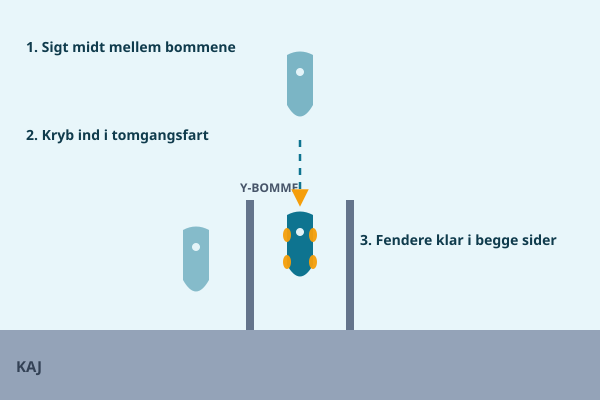
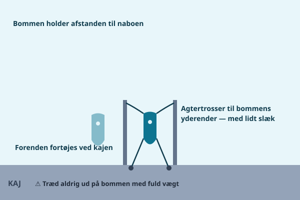
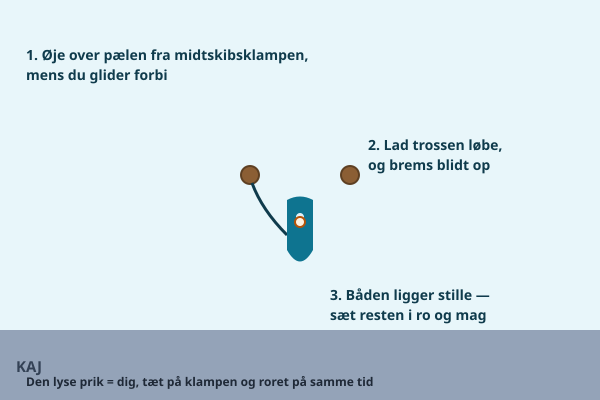

De fleste gæstepladser i Limfjordens lystbådehavne er ikke almindelig langskaj, men enten agterpæle eller Y-bomme. Begge dele kan virke uoverskuelige første gang, men de følger et fast mønster, og har du først forstået det, går det hurtigt.

## Hvad er forskellen

**Agterpæle** er to enkeltstående pæle placeret et stykke ude fra en kaj. Du bakker (eller sejler) ind mellem pælene, tager en trosse rundt om den ene eller begge, og fortøjer derefter forenden inde ved selve kajen. Systemet giver en fast plads uden Y-bom mellem bådene.

**Y-bomme** er en flydende bom formet som et Y, der stikker ud fra kajen, med én arm til hver af de to nabobåde. Du lægger til med agterenden mod kajen og forenden ud til bommen, eller omvendt alt efter havnens indretning, og bruger bommens arm til at fortøje forenden eller siden af båden. Y-bomme gør, at både kan ligge tættere, uden at skrabe skroget mod hinanden, fordi bommen holder afstanden.

## Grøn og rød — læs skiltene

De fleste gæstehavne markerer ledige og optagede pladser med farvede skilte eller bøjer ved pælen eller bommen — typisk grønt for ledig og rødt for optaget, men systemet varierer fra havn til havn. Tjek altid havnens eget system, før du lægger til, og vær opmærksom på, at nogle havne reserverer bestemte pladser til faste brugere selv uden for sæsonen. Er du i tvivl, så spørg i havnekontoret eller på VHF, før du fortøjer.

## Anløb mellem pæle

1. **Sigt midt mellem pælene**, ikke skævt mod den ene — det giver dig mest plads til at rette op undervejs.
2. Når du er tæt nok på, tager en fra besætningen en **trosse med øje over pælen** — brug øjet på trossen, ikke et knob, for det er hurtigt at få af og på, og det glider frit, hvis vandstanden ændrer sig. Gør dette **på vej ind**, mens båden stadig har lidt fart, så du ikke skal manøvrere tilbage for at nå pælen.
3. Fortsæt roligt ind mod kajen, og fortøj derefter **forenden til kajen** som sidste trin.

Når alle trosser er på plads, ligger båden fast mellem pælene og kajen — agtertrosser til begge pæle og fortrosser til kajen:

Mange vælger at **krydse agtertrosserne** — styrbord klampe til bagbord pæl og omvendt. Krydset gør linerne længere, så de arbejder bedre, når vandstanden ændrer sig, og det holder samtidig agterenden centreret i båsen. Sørg blot for, at trosserne ikke gnaver mod hinanden dér, hvor de krydser.

## Vind i pælebåsen

Vinden bestemmer rækkefølgen på dine trosser. I **sidevind** gælder én regel over alle andre: tag **luv-pælen først** — altså pælen i den side, vinden kommer fra. Med en trosse på luv-pælen kan vinden ikke sætte båden ned på læ-pælen eller naboen, og resten af manøvren kan foregå i ro og mag.

I **pålandsvind** — vind ind mod kajen — bliver båden ved med at skubbe fremad, længe efter du har taget farten af. Brug agtertrosserne som bremse: lad dem løbe kontrolleret ud, mens du glider ind, og stram op, **før** boven når kajen.

I **fralandsvind** er det omvendt boven, der skal sikres hurtigt: vinden blæser den væk fra kajen, så hav fortrossen klar, og hold motoren i gang, til den er fast.

## Y-bomme: fendere og forsigtighed

Ved Y-bomme gælder næsten de samme principper som ved et almindeligt anløb, blot med en flydende bom som ekstra element:

- **Fendere klar i den side, der vender mod bommen**, så bommens kant ikke skraber skroget.
- **Gå aldrig ud på selve bommen med fuld vægt** — den er lavet til at holde en fortøjningsline, ikke en person. Mange bomme er glatte og kan vippe under vægt, så træd forsigtigt, og hold fast i noget stabilt.
- Fortøj til bommens arm med en trosse, der har lidt slæk, så bommen kan bevæge sig naturligt med bølger og vandstand, uden at rykke i din fortøjning.

## Typiske fejl

- **At ramme pælen med fribordet**, fordi anløbsvinklen var for skæv, eller farten blev taget af for sent.
- **At glemme agtertrossen** og først opdage det, når båden allerede er begyndt at drive ind mod kajen eller naboen — fortøj altid begge ender, så snart du er inde på pladsen, selv hvis du "lige skal ordne noget andet".
- At undervurdere, hvor meget en Y-bom kan **bevæge sig i blæsevejr**, så fortøjningen strammes for hårdt op og giver et ryk i stedet for at flyde med.

## Solo-teknik

Er du alene om bord, er den mest pålidelige teknik at bruge en **midtskibsspring først**. Læg en lang trosse klar fra en midtskibsklampe, så du kan tage den om en pæl eller bomarm, mens du stadig sidder ved roret eller lige er sprunget fra borde. Med midtskibstrossen fastgjort ligger båden roligt nok til, at du kan gå frem og tilbage og få resten af fortøjningen på plads uden at skulle holde styr på hele båden med den ene hånd.

Læg gerne trosserne klar og tydeligt mærket, allerede før du sejler ind, så du ikke skal lede efter den rigtige line med den ene hånd på roret. Har du en fast gæsteplads, du vender tilbage til flere gange i sæsonen, kan det betale sig at øve rækkefølgen et par gange i roligt vejr, så hele forløbet — fra sigtelinje til sidste trosse — sidder på rygraden, næste gang du kommer ind med vind i pladsen.

## Vandstand og pæleafstand

Vandstanden i Limfjorden kan variere med vind og vejr, hvilket betyder, at afstanden mellem vandoverfladen og toppen af en pæl ændrer sig fra besøg til besøg. Tjek derfor altid, at trossens øje kan glide frit op og ned ad pælen, uden at sætte sig fast i en spids eller et fremspring — ellers risikerer du, at båden hænger fast i pælen, når vandstanden falder, eller at trossen strammes unødigt op, når vandstanden stiger.

> **Husk:** Sigt midt mellem pælene, brug øjet frem for knob på pælen, tag luv-pælen først i sidevind, og fortøj altid begge ender — også når du er alene om bord.
