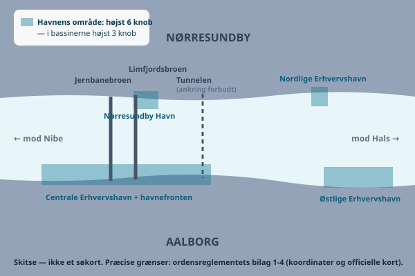

Fart er ikke bare et spørgsmål om, hvor hurtigt du kan komme frem. Tæt på land, i havne og nær badende handler det om andres sikkerhed — og om dit eget ansvar, hvis noget går galt.

## 300 meter-reglen — hvem gælder den egentlig for?

Den kendte "300 meter fra kysten"-regel stammer fra vandscooterbekendtgørelsen og gælder **kun** vandscootere, jetski og lignende fartøjer under 4 meter, hvor føreren sidder eller står *på* skroget. For dem er sejlads inden for 300 meter fra kystlinjen som udgangspunkt forbudt — zonen må kun krydses **vinkelret på kysten med maksimalt 5 knob**, og til og fra havn skal sejlløbet følges.

Det har en vigtig konsekvens i Limfjorden: hvor fjorden er smallere end 600 meter — som ved Aalborg — overlapper 300 meter-zonerne fra de to bredder hinanden, så en vandscooter reelt aldrig er uden for zonen. Bekendtgørelsen har ingen særregel for smalle farvande, så på de strækninger er der i praksis kun direkte, vinkelret gennemsejling med maks. 5 knob tilbage.

For almindelige motorbåde og speedbåde er billedet mere broget — og det er derfor, reglen på speedbådskurser ofte læres som gældende for *alle* motordrevne fartøjer. Der findes ikke én fast, landsdækkende 300 meter-regel for speedbåde. I stedet giver ordensbekendtgørelsens § 14 politiet hjemmel til at fastsætte lokale sejladsregler for motorbåde tæt på kysten, og det har de fleste politikredse gjort: nogle steder maks. 5 knob inden for en angivet kystzone, andre steder forbud mod at plane. Oveni kan kommunerne i badesæsonen forbyde speedbådssejlads helt ved udpegede badestrande. Reglerne er altså lokale og ikke ens på landsplan — for Nordjylland har vi ikke kunnet finde et offentliggjort sejladsreglement, så spørg politiet eller havnen, hvis du er i tvivl. Det sikre udgangspunkt er at sejle, som du lærte det på kurset: **maks. 5 knob og ingen planing inden for 300 meter fra kysten**.

Herudover gælder en bredere regel fra bekendtgørelsen om sejlads i visse danske farvande og de lokale politivedtægter: sejlads må aldrig være til fare, hindring eller unødig gene for badende eller anden sejlads, og du må ikke lave unødig støj til gene for andre. Der findes desuden lokale fartbegrænsninger forskellige steder i landet — fastsat af den enkelte politikreds eller kommune — så konkrete tal kan variere fra sted til sted.

## Havnereglementer: typisk 3–6 knob

Inde i selve havnebassinet gælder som regel en lav og fast fartgrænse, fastsat i havnens eget reglement. Flere danske lystbådehavne angiver 3 knob i selve havnebassinet som norm, mens nogle havneområder med bredere sejlløb tillader lidt mere fart uden for selve bådepladserne. Tallene varierer fra havn til havn, så det er altid havnens eget reglement, der gælder — ikke en landsdækkende standard. Tommelfingerreglen, når du er i tvivl: sejl så langsomt, at du ikke laver kølvand, og at du kan stoppe, før du rammer noget.

## Dit kølvand er dit ansvar

Det er en udbredt misforståelse, at man ikke kan holdes ansvarlig for skader forårsaget af ens eget kølvand, blot man overholder fartgrænsen. Sådan fungerer det ikke. Skader du en anden båd, en bro, en bolværkskant eller en person med dit kølvand — for eksempel fordi en fortøjet båd rives løs, eller fordi nogen falder om bord ved din bølge — kan du blive gjort erstatningsansvarlig, uanset om du sejlede inden for den skiltede fartgrænse. Domstole og forsikringsselskaber ser på, om du sejlede forsvarligt under de aktuelle forhold, ikke kun på et skilt. Sejl derfor ekstra forsigtigt forbi tætliggende bådebroer, ved smalle passager og i havneløb, hvor både ligger tæt fortøjet.

## Zoner ved badestrande

Ved populære badestrande langs Limfjorden — for eksempel ved Egholm, Hals eller de mange badebroer omkring Aalborg — bør du holde god afstand og sætte farten markant ned, uanset om der er en skiltet grænse. Badende kan dukke op tæt på båden uden varsel, og lyden af en motor bærer dårligt under vand, så svømmere hører dig ofte senere, end du tror.

## Ved Aalborg: 6 knob i havnen, 3 knob i bassinerne

Aalborg Havns ordensreglement (godkendt af Trafikstyrelsen i 2021) sætter helt konkrete grænser: **sejlads inden for havnens område må højst ske med 6 knob — i bassinerne højst 3 knob**. Reglementet dækker både Aalborg-siden og Nørresundby Havn. Skibe i ren transit forbi havnen henvises formelt til de generelle Limfjords-regler i stedet, men med broer, færgetrafik og tæt erhvervssejlads er rolig fart gennem byen under alle omstændigheder det rigtige valg. Læg dertil, at ankring er forbudt i et 200 meter bredt bælte hen over Limfjordstunnelen øst for broerne.

Og modsat hvad man kunne tro, findes der **ikke** udpegede områder ved Aalborg, hvor man må sejle hurtigere tæt på kysten end ellers — tværtimod kræver vandski, kapsejlads og vandscootersejlads inden for havnens område havnemyndighedens forudgående tilladelse.

Havnens område er større, end mange tror. Det dækker havnefronten fra Norden Bro i vest, forbi broerne og gennem hele byen til Portland-området i øst, plus Nørresundby Havn og de Nordlige og Østlige Erhvervshavne ude ved tunnelen og Hals-siden:

Sat sammen ser fart-lagene ved Aalborg sådan ud:

1. **Ude i fjorden og i renden** (uden for havneområdet og brozonerne): ingen fast knob-grænse — du må gerne plane, når forholdene tillader det.
2. **Inden for havnens område** (se skitsen): højst **6 knob** — i bassinerne højst **3 knob**.
3. **Ved broerne:** kun manøvrefart, og følg brovagtens anvisninger.
4. **Altid og overalt:** søvejsreglernes krav om sikker fart — og dit kølvand er dit ansvar.

## Sejlrenden ved Aalborg: hold dig fri af erhvervstrafikken

I den smalle fjord ved Aalborg fylder den afmærkede rende en stor del af farvandet, og her gælder søvejsreglernes regel 9 om snævre løb: hold dig så tæt, som det er sikkert, på rendens **styrbords side**, og — vigtigst for dig som fritidssejler — **både under 20 meter må ikke vanskeliggøre passagen for skibe, der kun kan sejle sikkert i selve renden**. Et lastskib i renden stikker for dybt til at sejle andre steder, har en stoppelængde på flere hundrede meter og kan hverken dreje udenom eller bakke op — det er dig, der skal holde dig fri, og du må heller ikke krydse renden, hvis det generer et skib, der er bundet til den. Kig jævnligt bagud: erhvervsskibene gør 10-12 knob og indhenter dig hurtigere, end man tror.

**Hvad betyder regel 9 så for farten?** Reglen nævner ikke fart med ét ord — men den gør fart til et værktøj, du skal bruge aktivt. Skal du krydse renden, så gør det *hurtigt* og vinkelret, når der er frit — ikke listende. Venter du på broåbning, så lig ikke og driv i renden med et fragtskib i ryggen. Og uden for havneområdet og brozonerne er der ingen fast knob-grænse i renden, så her må du gerne sejle hurtigere end 5 knob — også plane, hvis forholdene tillader det. Det reelle loft er søvejsreglernes regel 6 om *sikker fart*: du skal altid kunne nå at reagere efter trafik, sigt og manøvreplads, og dit kølvand langs havnefronten og de fortøjede både er dit ansvar.

Omkring Limfjordsbroen og Jernbanebroen gælder desuden skærpede regler om manøvrefart og pligt til at følge brovagtens anvisninger — se guiden om broerne i Limfjorden. De aktuelle broreglementer findes i Den Danske Havnelods.

## Sådan finder du de lokale regler

Før du sejler et nyt sted, er det en god vane at slå havnens reglement op på havnens egen hjemmeside — de fleste danske lystbådehavne har det liggende som PDF eller på en underside om "havneregler" eller "ordensreglement". Her står typisk fartgrænser, regler for fortøjning, affaldshåndtering og eventuelle særlige hensyn. Er du i tvivl, så spørg havnefogeden — de færreste bliver sure over et opklarende spørgsmål, men mange bliver det over en bølge, der vælter naboens kaffekop.

## Bøder og ansvar

Overtrædelse af fartbegrænsninger og sejladsregler kan udløse bøde, og politiet håndhæver reglerne på vandet ligesom på vejene. Men den økonomiske risiko ved skader på andres ejendom er ofte langt større end en bøde — derfor er en gyldig ansvarsforsikring på båden ikke bare en god idé, men i mange tilfælde et lovkrav (se guiden om beviser og krav). Kombinationen af eftertænksom sejlads og korrekt forsikring er den bedste beskyttelse, du kan give dig selv og andre.

## Kilder

- [Bekendtgørelse om sejlads m.m. i visse danske farvande, BEK nr. 1316 af 21/11/2023 — Retsinformation](https://www.retsinformation.dk/eli/lta/2023/1316/pdf)
- [Vandscooterbekendtgørelsen, BEK nr. 809 af 09/08/2019 — Retsinformation](https://www.retsinformation.dk/eli/lta/2019/809)
- [Styrelsen for Grøn Arealomlægning og Vandmiljø — Regler for færdsel på havet](https://sgavmst.dk/natur-og-jagt/regler-for-faerdsel-i-naturen/hvor-maa-jeg-faerdes/paa-havet)
- [Ordensreglement for Aalborg Havn (PDF — bilag 1-4 har officielle kort og koordinater for havnens område) — Port of Aalborg](https://portofaalborg.dk/wp-content/uploads/2023/03/ordensreglement-for-aalborg-havn.pdf)
- [Bekendtgørelse om søvejsregler, BEK nr. 1083 af 20/11/2009 (regel 6 og 9) — Retsinformation](https://www.retsinformation.dk/eli/lta/2009/1083)
- [Bekendtgørelse om sejlads på Limfjorden mellem Egholm og Kattegat, BEK nr. 953 af 18/12/1991 — Retsinformation](https://www.retsinformation.dk/eli/lta/1991/953)
- [Den Danske Havnelods — aktuelle broreglementer og havneoplysninger](https://www.danskehavnelods.dk/)
- [Ordensbekendtgørelsen, BEK nr. 511 af 20/06/2005 (§ 14 om politiets lokale sejladsregler) — Retsinformation](https://www.retsinformation.dk/eli/lta/2005/511)
- [Dansk Sejlunion — restriktioner og fartbegrænsninger for lystsejlere (oversigt over politikredsenes reglementer)](https://dansksejlunion.dk/viden-og-vedligeholdelse/regler-og-love-for-fritidssejlads/restriktioner-og-fartbegraensninger-for-lystsejlere)

> **Husk:** En fartgrænse fritager dig ikke for ansvar — dit kølvand er altid dit ansvar, uanset hvad skiltet siger.
