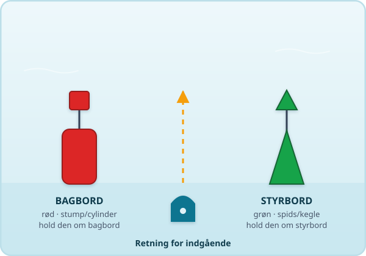
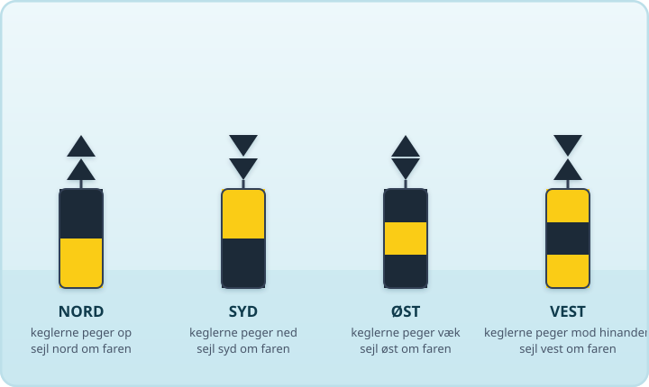
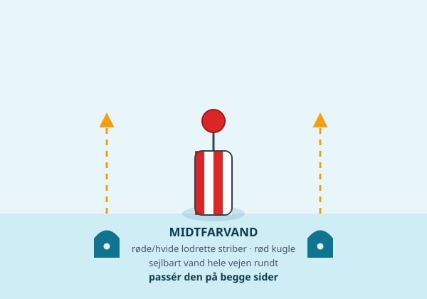
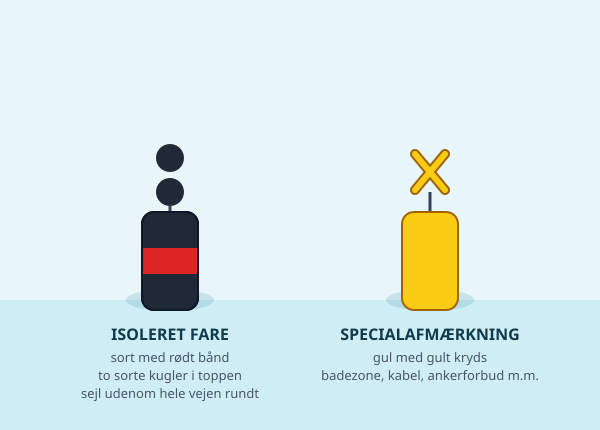
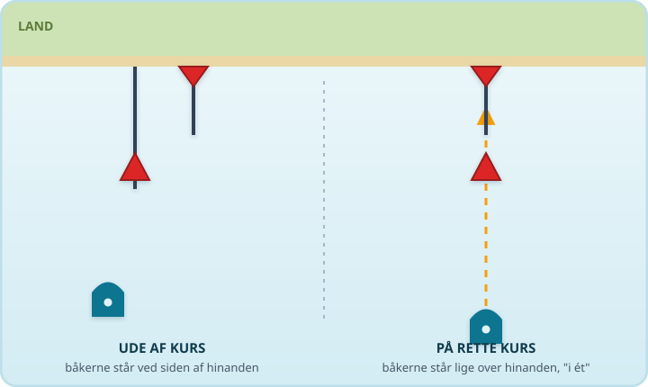
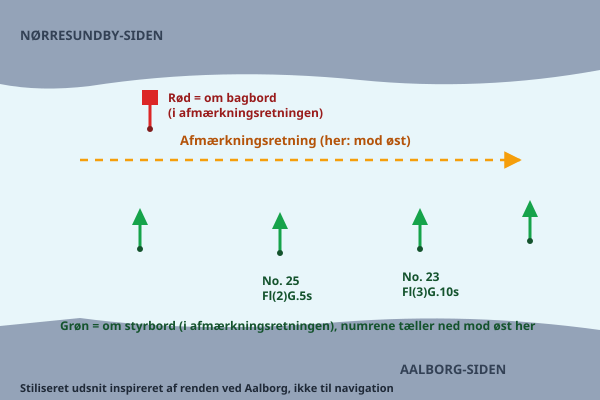

Bøjerne på vandet er søens vejskilte. De fortæller dig, hvor der er dybt nok, og hvor du skal holde dig væk. Kan du læse dem, er du langt bedre rustet til at finde vej sikkert gennem Limfjordens render og løb.

## Sideafmærkning — rød og grøn

Danmark bruger IALA system A, ligesom stort set hele Europa. Grundprincippet er: **grøn om styrbord, rød om bagbord — når du sejler i retningen for indgående** (det vil sige i den retning, afmærkningen er sat op til at blive fulgt fra søen og ind mod havn eller fjord). Det betyder:

- **Grøn bøje/båke** (ofte spids eller kegleformet) skal du have på din **styrbord side** (højre side), når du følger retningen for indgående.
- **Rød bøje/båke** (ofte rund eller cylinderformet) skal du have på din **bagbord side** (venstre side) på samme kurs.

Sejler du den modsatte vej, vender det naturligvis om — rød om styrbord, grøn om bagbord. Derfor er det afgørende at kende retningen for indgående i det farvand, du sejler i. Retningen er markeret på søkortet, typisk med en pil-symbol, og den følger ikke nødvendigvis kompasretning eller "fra Vesterhavet mod Kattegat" — den er fastsat lokalt for hver sejlrende og fremgår altid af søkortet. I Limfjorden skifter afmærkningens hovedretning undervejs, blandt andet omkring Aalborg, så tjek altid dit søkort for den aktuelle strækning i stedet for at regne med en fast tommelfingerregel hele vejen fra Thyborøn til Hals.

### Huskeregel

Den klassiske huskesætning er: "Rød til bagbord, når du kommer hjem" — altså når du sejler ind ad renden i den retning, kortet viser som indgående. Er du det mindste i tvivl om retningen, så kig efter pilesymbolet på søkortet, eller sejl efter en anden fast regel: hold dig til midten af den dybe rende, og læg mærke til, hvilken side andre både med større dybgang holder sig til.

## Kardinalafmærkning — kompasset viser vej

Hvor sideafmærkning fortæller "hold dig til den ene side", fortæller kardinalafmærkning i stedet, hvilken kant af en fare du skal sejle uden om — ud fra verdenshjørnerne:

- **Nord-mærke** (to sorte topfigurer, der peger opad): faren er syd for mærket — sejl nord om.
- **Syd-mærke** (to sorte topfigurer, der peger nedad): faren er nord for mærket — sejl syd om.
- **Øst-mærke** (topfigurer der peger væk fra hinanden): faren er vest for mærket — sejl øst om.
- **Vest-mærke** (topfigurer der peger mod hinanden): faren er øst for mærket — sejl vest om.

Kardinalmærker er gule og sorte og bruges typisk til at markere fx et lavvandet område, en vraggrund eller en kant af en sejlrende, hvor faren ikke ligger midt i, men til én bestemt side.

## Midtfarvandsafmærkning — sikkert vand hele vejen rundt

Hvor sideafmærkning fortæller "hold dig til den ene side", betyder midtfarvandsafmærkning det modsatte: her er der sejlbart vand hele vejen rundt om mærket, og du kan passere det på **begge sider**.

- **Farve:** røde og hvide lodrette striber.
- **Topbetegnelse:** én rød kugle.
- **Lys (hvis bøjen har lys):** hvidt — typisk et langt blink hvert 10. sekund eller isofase.

Den bruges til at markere midten af et farvand, begyndelsen på et sejlløb eller havneløb, eller som landkending, når du søger ind mod kysten. Møder du en midtfarvandsbøje i et snævert løb, er det god skik at holde den om bagbord (passere den på din styrbord side), så modgående trafik kan gøre det samme — men tjek altid søkortet for den konkrete strækning.

## Isoleret fare og specialafmærkning

**Isoleret fare-afmærkning** (sort med en eller flere røde bånd, to sorte kugler i toppen) markerer en lille, afgrænset fare — for eksempel et vrag — som du kan sejle rundt om i alle retninger, blot du holder dig fra selve mærket.

**Specialafmærkning** er gul og bruges til alt muligt, der ikke handler om sejladssikkerhed i sig selv: badezoner, ankerforbudsområder, kabler og rørledninger, forskningsbøjer eller afgrænsning af militærområder. Den gule farve betyder "vær opmærksom" — betydningen af den konkrete bøje står typisk beskrevet i søkortet eller i "Efterretninger for Søfarende".

## Badezoner

Gule specialbøjer bruges ofte til at markere grænsen for badeområder ved strande langs Limfjorden. Hold god afstand og sæt farten kraftigt ned, når du sejler i nærheden — badende kan dukke op, hvor du mindst venter det, og de er svære at se fra en båd.

## Båker og overrettemærker

Ikke al afmærkning flyder. **Båker** er *fast* afmærkning — figurer på pæle, anbragt på land eller på lavt vand — i modsætning til bøjerne, der ligger for anker og gynger med vandet. En båke kan stå alene som et sømærke, men det mest nyttige er, når de står to og to og danner et **overrettemærke** (også kaldet en *fyrlinje*).

Et overrettemærke består af to båker: en lav forreste og en høj bageste, sat op efter hinanden. Når du ser dem stå **lige over hinanden — "i ét"** — sejler du på den sikre linje ind gennem løbet. Står de forskudt ved siden af hinanden, er du ude af kurs: drej roligt, indtil den bageste båke står præcis over den forreste igen.

Om natten er mange overrettemærker forsynet med lys (en *fyrlinje*), så du kan følge linjen i mørke — se guiden om lanterner og sejlads i mørke. Overrettemærker er især værd at kende i smalle indsejlinger, hvor der ikke er plads til at famle sig frem efter enkelte bøjer.

## Sådan står det på søkortet — numre og lyskarakterer

På søkortet har afmærkningen to påskrifter, der er guld værd, når du først kan læse dem. Her er et stiliseret udsnit, som det kunne se ud i renden ved Aalborg:

**Numrene** (fx *No. 23* og *No. 25*) er afmærkningens fortløbende numre i sejlløbet. De gør det nemt at stedfæste sig entydigt: "jeg ligger ved bøje 25" er præcist — både i et kald til brovagten og i en nødsituation.

**Lyskarakteren** (fx *Fl(2)G.5s*) er bøjens fingeraftryk i mørke. Den læses stykke for stykke: *Fl* = blink, *(2)* = to blink i en gruppe, *G* = grønt lys, *5s* = mønstret gentages hvert 5. sekund. Om natten identificerer du altså en bøje ved at tælle blink og tage tid på gentagelsen. De mest almindelige forkortelser:

| Notation | Betydning |
|---|---|
| F.G / F.R | Fast (konstant) grønt/rødt lys |
| Fl.G.3s | Ét grønt blink, gentaget hvert 3. sekund |
| Fl(2)G.5s | Gruppe på to grønne blink hvert 5. sekund |
| Q | Hurtigblink — omkring ét blink i sekundet |
| Iso | Isofase — lige lang tid tændt og slukket |

Se også guiden om lanterner og sejlads i mørke, hvor lyskaraktererne for alvor kommer i spil.

## Hvad gør du, hvis du er i tvivl?

Er du usikker på, hvad en bøje betyder, eller kan du ikke se den tydeligt: sæt farten markant ned, og hold ekstra udkig. Tjek søkortet igen — de fleste tvivlstilfælde løses ved at se efter, hvilken type mærke det er (form, farve, topfigur), og sammenholde det med kortet. Naviger aldrig "på må og få" i ukendt farvand; hellere en omvej end en grundstødning.

## Søkort og apps

Et opdateret søkort er dit vigtigste redskab — både i papirform og som app. Der findes flere gode muligheder, herunder officielle danske søkortdata og velkendte navigationsapps til telefon og plotter. Uanset hvilken løsning du vælger, så sørg for at den er opdateret, og brug den sammen med din egen udkig — elektronikken kan fejle eller vise forældede data, dine øjne gør ikke.

## Kilder

- [Bekendtgørelse om farvandsafmærkning i dansk og grønlandsk afmærkningsområde m.v. (Afmærkningsbekendtgørelsen), BEK nr. 1466 af 29/06/2021 — Retsinformation](https://www.retsinformation.dk/eli/lta/2021/1466)
- [Søfartsstyrelsen — Afmærkning af farvande](https://www.soefartsstyrelsen.dk/sikkerhed-til-soes/sejladssikkerhed/afmaerkning-af-farvande)

> **Husk:** Er du i tvivl om en bøje eller en retning, så sæt farten ned og tjek søkortet igen — det er altid billigere end en grundstødning.
