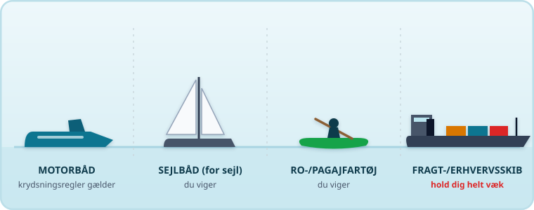
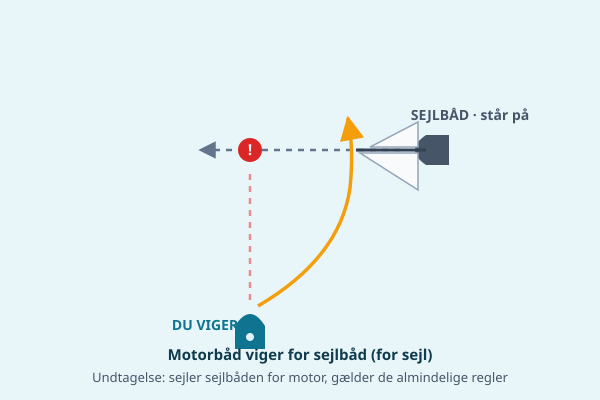
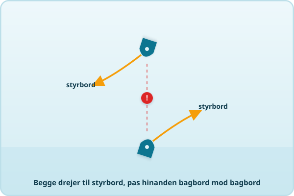
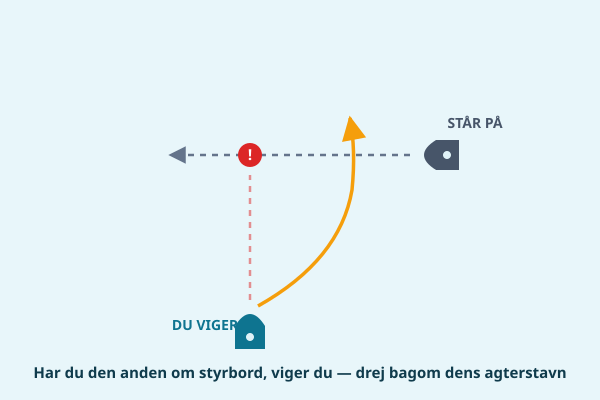
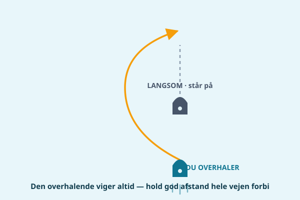

Søvejsreglerne kan lyde som juratekst, men i praksis handler det hele om én ting: undgå at støde sammen med en anden båd. Har du styr på grundprincippet og en håndfuld faste regler, kan du sejle roligt og trygt overalt på Limfjorden.

## Det vigtigste princip af alle

Uanset hvad reglerne siger, gælder én regel over dem alle: du skal gøre, hvad der skal til for at undgå en kollision — også hvis du "har ret". Søvejsreglerne (bekendtgørelse om søvejsregler) kalder det "godt sømandskab", og en dommer eller forsikringssag vil altid spørge, om du gjorde det, der var nødvendigt for at undgå ulykken. At have vigepligt betyder ikke, at du må sejle videre og håbe på det bedste, hvis den anden ikke reagerer.

## Genkend, hvad du møder på vandet

Før du kan bruge vigereglerne, skal du kunne genkende, hvad det er for en slags fartøj, du møder — for reglerne afhænger af typen. Her er de fire, du oftest støder på i Limfjorden:

- **Motorbåd** — kendes på fri stævn uden sejl og typisk en åben styrepult eller kahyt. Møder du en anden motorbåd, gælder krydsnings- og mødereglerne nedenfor.
- **Sejlbåd (for sejl)** — høj mast med sejl sat. Så længe motoren *ikke* kører, er det en sejlbåd, og du viger. Kører motoren, tæller den som motorbåd — det kan være svært at se, så hold øje med, om sejlene reelt trækker.
- **Ro-/pagajfartøj** — kajakker, robåde og SUP'er ligger lavt, er svære at få øje på og kan ikke flytte sig hurtigt. Du viger og giver god plads.
- **Fragt-/erhvervsskib** — stort skib med overbygning agter, ofte bundet til den dybe rende. Det kan hverken stoppe eller dreje for dig — hold dig helt væk, uanset hvad reglerne ellers siger.

## Motorbåd viger for sejlbåd og robåd

Som udgangspunkt skal en motordrevet båd vige for et sejlskib, der sejler for sejl, og for en robåd. Tommelfingerregel: hvis den anden kan sejle uden motor, viger du. Der er dog vigtige undtagelser:

- Sejler sejlbåden for motor (motoren kører, uanset om sejlene er oppe), tæller den som motorbåd og skal selv følge de almindelige regler.
- I snævre løb og sejlrender må mindre fartøjer og sejlbåde ikke være til hinder for et større skib, som kun kan manøvrere sikkert inde i selve rendens dybe vand — mere om det nedenfor.
- Fartøjer, der overhaler, skal altid vige (se nedenfor), uanset hvad de sejler for.

## Stævn mod stævn: begge drejer styrbord

Møder to motorbåde hinanden næsten stævn mod stævn — på kollisionskurs, lige på — skal begge dreje til styrbord (højre) og passere hinanden bagbord mod bagbord, ligesom biler der kører i hver sin vejside. Er du i tvivl om, hvorvidt I mødes helt stævn mod stævn, så drej alligevel til styrbord tidligt og tydeligt — det er den sikre løsning.

## Krydsende kurser

Krydser to motorbådes kurser hinanden, så der er risiko for sammenstød, er reglen: den båd, der har den anden båd om styrbord (på sin højre side), skal vige. Har du en anden båd kommende ind fra din højre side, er det altså dig, der skal holde af vejen — typisk ved at nedsætte farten eller dreje bagom den andens agterstavn. Den, der har vigepligt, skal vige tidligt, tydeligt og i god afstand, så den anden ikke er i tvivl om dine hensigter.

## Overhaling — den overhalende viger altid

Vil du overhale en anden båd, er det dig, der har vigepligt, uanset hvad den forankørende sejler for. Selv en motorbåd, der overhaler en langsom robåd, skal holde godt af vejen og give plads. Reglen gælder, indtil du er helt forbi og klar af den andens kurs.

## Hold godt til styrbord i snævre løb

Limfjorden byder mange steder på smalle render — tænk på indsejlingen ved Løgstør, Aggersund eller strækningerne omkring Thisted. Her gælder en særlig regel: sejl så langt til styrbord i renden, som det er sikkert og praktisk muligt. Det gælder også, selvom du egentlig "har ret" til at ligge midt i løbet. Krydser du en snæver rende, skal du gøre det så vinkelret som muligt og undgå at spærre for skibe, der er afhængige af at sejle i selve renden.

## Erhvervstrafik og store skibe — hold dig væk

I sejlrenderne gennem Limfjorden færdes fragtskibe og andre erhvervsfartøjer, som er bundet til den dybe rende og ikke kan stoppe eller dreje hurtigt. De kan bogstaveligt talt ikke vige for dig, selvom reglerne skulle tilsige det. Som lille motorbåd er det dit ansvar at holde god afstand, krydse renden hurtigt og vinkelret, og aldrig regne med, at et stort skib kan nå at reagere på dig. Hold ekstra øje ved snævre passager og broåbninger, hvor erhvervstrafik ofte har forrang.

## Lydsignaler — de vigtigste at kunne

Når I kan se hinanden og skal signalere en manøvre, bruges korte stød på hornet:

- **Ét kort stød** = "Jeg drejer til styrbord."
- **To korte stød** = "Jeg drejer til bagbord."
- **Tre korte stød** = "Jeg bakker."
- **Mindst fem korte stød (hurtigt efter hinanden)** = "Jeg forstår ikke dine hensigter" eller "pas på!" — brug det, hvis du er i tvivl om, hvad den anden båd har tænkt sig, eller hvis en situation ser farlig ud.

I praksis bruger de fleste fritidssejlere sjældent lydsignaler, men det er godt at kunne genkende dem, når et større skib eller erhvervstrafikken bruger dem over for dig.

## Praktisk Limfjords-eksempel

Du sejler ud fra Hals mod Aalborg en sommereftermiddag. Foran dig krydser en sejlbåd for sejl din kurs fra bagbord side — du har vigepligt efter både krydsningsreglen og hovedreglen om motor viger for sejl. Du sætter farten ned i god tid og drejer let bagom sejlbådens agterende, så skipperen tydeligt kan se, at du har set båden og har styr på situationen. Lidt senere overhaler du en robåd tæt på land — her er det dig, der skal holde afstand og fart, uanset at robåden er den langsomste.

## Kilder

- [Bekendtgørelse om søvejsregler, BEK nr. 1083 af 20/11/2009 — Retsinformation](https://www.retsinformation.dk/eli/lta/2009/1083)
- [Søfartsstyrelsen — regler og bekendtgørelser](https://www.soefartsstyrelsen.dk/vaekst-and-rammevilkaar/regler-og-cirkulaerer/regler-og-bekendtgoerelser)

> **Husk:** Vigepligt er ikke en ret til at sejle videre — det er en pligt til at holde godt øje og reagere i god tid. Er du i tvivl, så sæt farten ned og hold afstand.
